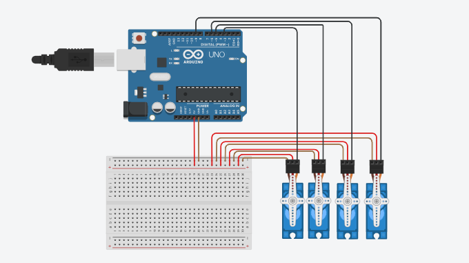

# Humanoid Robot Servo Control – Arduino Project

This project demonstrates how to control 4 servo motors using Arduino UNO to simulate motion in a humanoid robot.

The project involves:
- Running a sweep motion (0° → 180° → 0°)  
- Then fixing all servos at 90 degrees
- The motion only runs once, then motors stay fixed

This behavior is useful when simulating limbs or joints that initialize then hold a fixed position.

# Circuit Diagram
See the circuit diagram below for how to connect the servo motors to the Arduino.

# Tinkercad Simulation

You can view and run the simulation here:  
🔗[Tinkercad Link](https://www.tinkercad.com/things/awEof1thwt2-servomotors)

# Source Code

📄 [servo_motors.ino](./servo_motors.ino)

